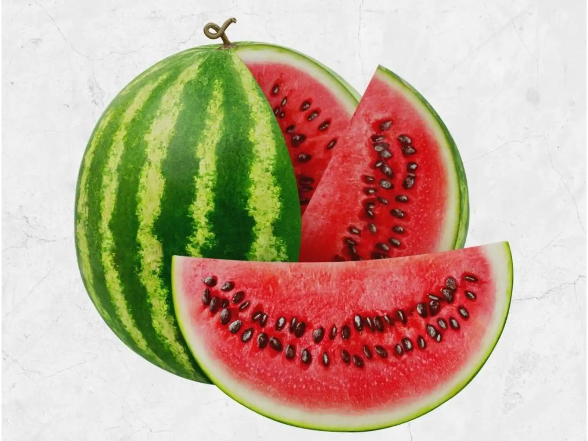

# Assignment 36

## Turn Watermelon into Materwelon using HSV

## Color Recognition with webcam using HSV color space

## Balloons Detection

## Blue Screen

## Change clothes color

## Change Spiderman's clothes

### too

